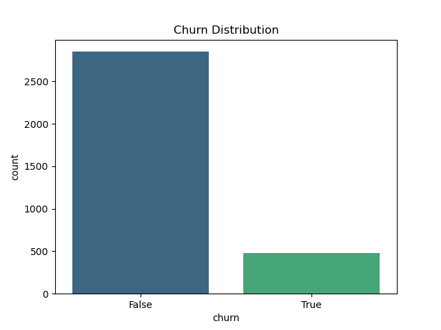
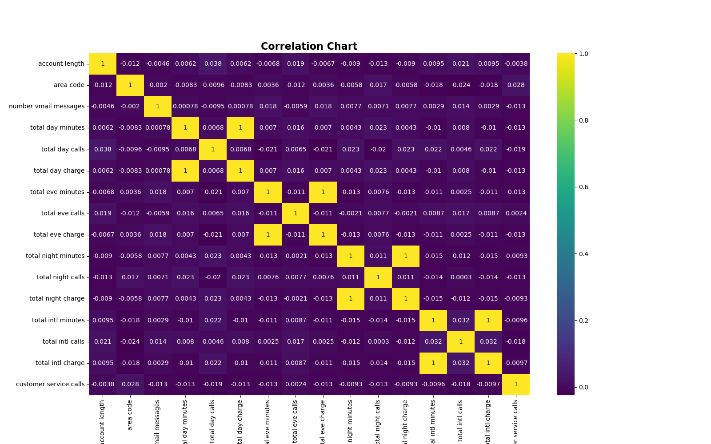
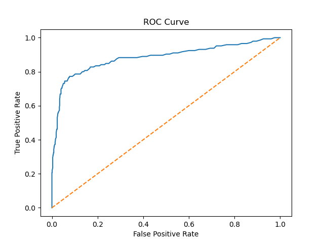
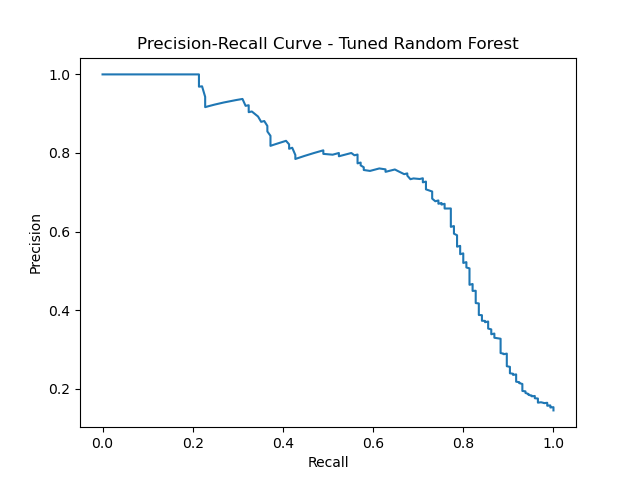
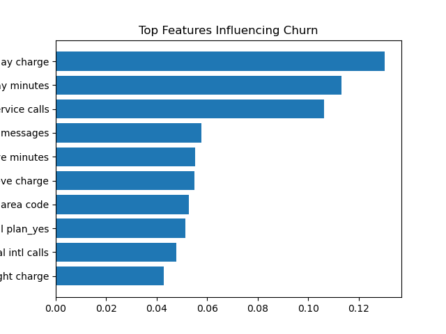

---

# Customer Churn Prediction (SyriaTel)

---

## 1. Project Overview

Customer churn is a major source of revenue loss in the telecom industry. This project develops a machine learning model to predict customer churn for **SyriaTel** and identify the key factors driving it.

The solution supports **data-driven retention strategies** to improve customer lifetime value.

---

## 2. Objectives

* Predict customer churn (binary classification)
* Identify key churn drivers
* Provide actionable business insights

---

## 3. 📂 Dataset

* **File:** `SyriaTel.csv`
* **Target Variable:** `churn`

### Key Features:

* Usage: `total day minutes`, `total eve minutes`, `total night minutes`, `total intl minutes`
* Charges: corresponding cost variables
* Customer behavior: `customer service calls`
* Plans: `international plan`, `voice mail plan`

---

## 4. Exploratory Data Analysis

###  Churn Distribution

* Strong class imbalance (~85.5% non-churn vs ~14.5% churn)

---

###  Feature Correlation

* High multicollinearity observed:

 *  Strong multicollinearity:
  * - day minutes <-> day charge
  * - eve minutes <-> eve charge
  * - night minutes <-> night charge
  * - intl minutes <-> intl charge

---

## 5. Data Preprocessing

* Dropped irrelevant columns: `phone number`, `state`
* One-hot encoded categorical variables
* Converted `churn` to numeric
* Train-test split: **70/30**
* Addressed class imbalance using **SMOTE**

---

## 6. Models Implemented
- Logistic Regression (balanced class_weight)
- Logistic Regression (GridSearchCV tuned):
- Decision Tree (max_depth=5)
- Random Forest (baseline)
- Random Forest ( tuned via GridSearchCV)

---

## 7. Model Performance

### Confusion Matrix

### ROC Curve

### Precision-Recall Curve

### Metrics (Random Forest)

* **Accuracy:** ~92%
* **F1 Score:** ~0.72
* **ROC-AUC:** ~0.88

Strong predictive performance
Class imbalance requires monitoring

---

## 8. Feature Importance

### Key Drivers:

* `customer service calls`
* `total day charge` / `total day minutes`
* `international plan`
* Evening and night usage patterns

---
## 9. Limitations

* No temporal (time-based) features included
* SMOTE may introduce slight overfitting
* Model may need retraining for different markets

---

## 10. Business Recommendations

* Target customers with frequent service calls
* Offer incentives to high-usage customers
* Reevaluate international plan pricing/value
* Deploy model in CRM for proactive churn alerts
* Monitor performance and retrain periodically

---

## 11. Tech Stack

* Python
* Pandas, NumPy
* Scikit-learn
* Matplotlib, Seaborn

---

## 12. Conclusion

The **Tuned Random Forest model** provides the best performance for predicting churn. It enables proactive, data-driven customer retention strategies and supports better business decision-making.

---

##  Author

**Brian**

---

 feel free to reach out to me:
 - brayoire@gmail.com
---
